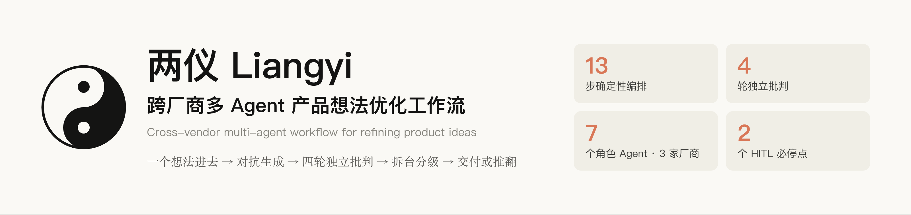
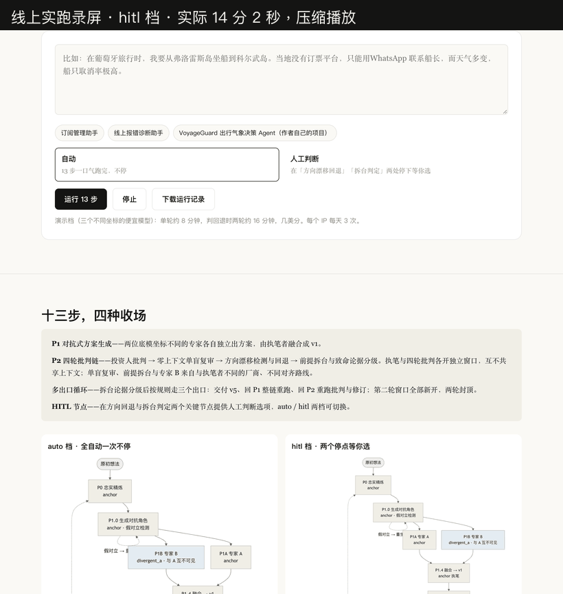
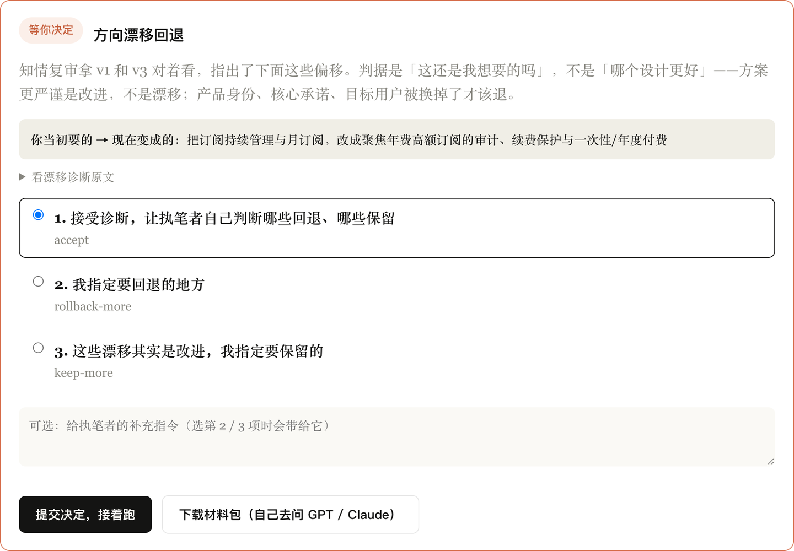
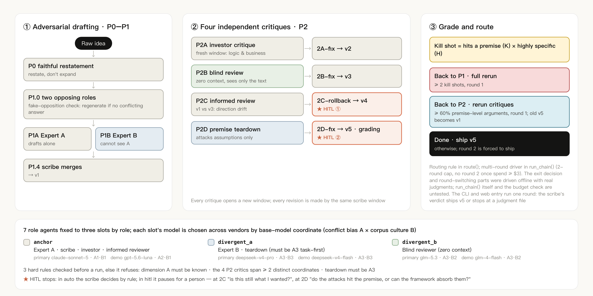
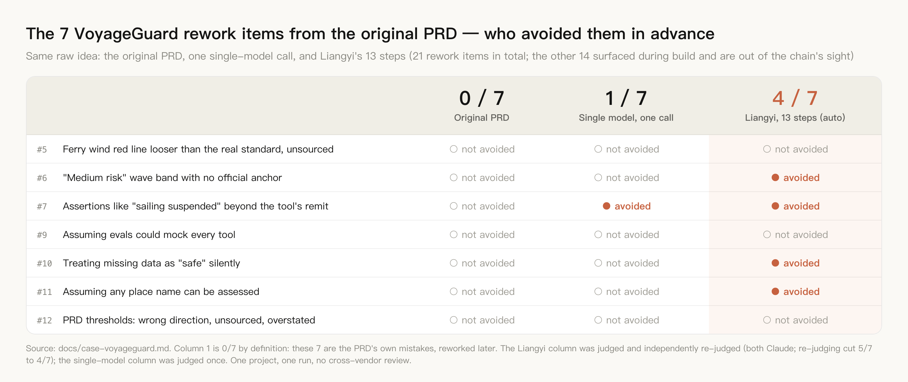
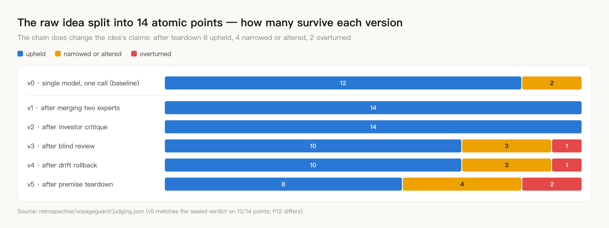

<p align="center">
  
</p>

<p align="center">
  <a href="https://liangyi-five.vercel.app"><strong>Live demo</strong></a> &middot;
  <a href="#quick-start"><strong>Quick start</strong></a> &middot;
  <a href="#architecture"><strong>Architecture</strong></a> &middot;
  <a href="#evaluation"><strong>Evaluation</strong></a> &middot;
  <a href="README.md"><strong>中文</strong></a>
</p>

<p align="center">
  <a href="https://liangyi-five.vercel.app"></a>
  
  <a href="engine/test_guarantees.py"></a>
  
  <a href="LICENSE"></a>
</p>

<p align="center">
  
  <br><sub>Recording of a live run (hitl mode, time-compressed): pick an example idea → 13 steps → one decision at each of the two stops → result. The UI is in Chinese.</sub>
</p>

# Liangyi · Cross-vendor multi-agent workflow for refining product ideas

One product idea in; one proposal out, after four independent critiques. Seven role agents with isolated contexts, spread across three vendors and assigned by base-model coordinate: the idea is first restated faithfully, two opposing experts draft without seeing each other and are merged, then the draft goes through investor critique → zero-context blind review → drift diagnosis → premise teardown, and finally the scribe grades the teardown arguments under a fixed rule and decides whether to ship v5 or overturn the direction.

**Why: a single model that writes and reviews its own work cannot see its own blind spots.**

|        | Stage | What happens |
| ------ | --- | --- |
| **01** | Restate and draft adversarially | P0 restates the idea faithfully; P1.0 generates two opposing roles and checks for fake opposition; the two experts draft blind to each other; the scribe merges them into v1 |
| **02** | Four independent critiques | Investor critique → blind review → drift diagnosis → premise teardown. Every critique opens a new window; every revision is made by the same scribe window |
| **03** | Grade and route | Teardown arguments are graded by "hits a premise × highly specific". The routing rule defines three exits: back to P1 (full rerun) / back to P2 (rerun the critiques) / done, capped at two rounds; the CLI and web entry currently run one round, and the round-2 machinery was only driven offline |

<sub>一念生两仪，两仪成决策 — one thought gives rise to two polarities; the two polarities make a decision.</sub>

## Contents

- [Live demo](#live-demo)
- [Quick start](#quick-start)
- [The problem](#the-problem)
- [Architecture](#architecture): [Where it sits](#where-it-sits) · [Multi-agent system design](#multi-agent-system-design) · [Seven roles and their models](#seven-roles-and-their-models) · [Three exits](#three-exits) · [Full state machine](#full-state-machine)
- [Evaluation](#evaluation): [Retrospective](#retrospective) · [Engineering checks](#engineering-checks) · [What is and isn't verified](#what-is-and-isnt-verified)
- [Repository layout](#repository-layout) · [Further reading](#further-reading) · [Other projects by the author](#other-projects-by-the-author)

## Live demo

**https://liangyi-five.vercel.app** — type an idea and watch it go through all 13 steps. The page ships three examples: a subscription manager, an error-diagnosis assistant for production services, and VoyageGuard, a travel-weather decision agent (the author's own project).

The demo tier uses three cheap models on three different coordinates (gpt-5.6-luna · deepseek-v4-flash · glm-4-flash). One chain takes about 6–10 minutes and about $0.07–0.09 as booked in the trace (the recording above: 7 min 32 s, $0.083; the trace books the 13 steps only, not helper calls such as the shadow detectors). Each IP can start 3 new chains per day.

- **Two modes**: "auto" runs straight through; "human judgment" stops at drift rollback (2C) and the teardown verdict (2D) and shows a decision card.
- **Decision card**: at 2C it leads with a one-line "you wanted X, it has become Y" summary (on the web, generated by gpt-5.6-luna from the merged v1 vs v3; the CLI compares the raw idea against the drift diagnosis), with the drift diagnosis underneath; at 2D it shows the scribe's grading table and verdict for every teardown argument. Both offer the same three options as the CLI plus an optional instruction. "Accept" reuses the output already produced, with no extra model call; 2C "roll back what I specify" / "keep what I specify" or 2D "revise per my instruction" reruns that one step with your instruction; 2D "the premise really is wrong, back to P1" ends the chain with a judgment file. An advisor brief can be downloaded to ask another model yourself.
- **Run controls**: stop, resume, retry only the failed step, download the full run record. The server is stateless; the run directory travels in the request body.

<p align="center">
  
</p>

## Quick start

```bash
pip install -r requirements.txt
cp .env.example .env                                         # fill in keys; comments say which vendor serves which window
python3 -m engine.run --check                                # preflight: 3 hard rules + whether each provider's key is set (env lookup only, no API call)
python3 -m engine.run -s scenarios/what-to-wear.yaml         # primary tier, auto mode (this scenario pre-writes the roles, so P1.0 is skipped: 12 model steps)
python3 -m engine.run -s scenarios/what-to-wear.yaml -p demo --mode hitl   # cheap demo tier + the two stops
python3 -m engine.run --resume runs/<run-dir>                # resume an interrupted run
```

Inspect the result:

```bash
python3 -m engine.inspect runs/<run-dir>                          # who ran each step, what it cost
python3 -m engine.inspect runs/<run-dir> --step P2D               # one step's input and output
python3 -m engine.inspect runs/<run-dir> --reasoning              # reasoning traces for every step
python3 -m engine.inspect runs/<run-dir> --diff idea-v1.md idea-v5.md
```

Local web entry: `python3 web/server.py`, then open `http://127.0.0.1:8765`. Deployment notes: [`web/DEPLOY.md`](web/DEPLOY.md).

## The problem

Ask an AI about your idea and it agrees with you. Ask again — still agrees. Three rounds later the plan looks polished, but nothing in it was ever seriously opposed. **Its boundaries were drawn by the model's compliance, not by your judgment.**

| Asking one model directly | Liangyi |
| --- | --- |
| The same model writes the plan and judges it | Writing and reviewing happen in separate windows; Expert B, the blind review and the premise teardown come from vendors and alignment lineages different from the scribe's |
| All feedback arrives at once, several frames to weigh together | Four critiques run in sequence, one round at a time, and the scribe decides item by item what to accept; every revision comes from the same scribe window, so the plan doesn't become a collage of several AIs |
| The plan drifts and nobody notices | P2C compares v1 with v3 specifically for drift; 2C-rollback reverts it |
| A wrong premise gets polished anyway | P2D is instructed to attack only the direction's premises (the scribe still grades some of its arguments as framework-internal); the scribe grades every argument, and two or more kill shots mean a "back to P1" verdict that stops at a judgment file instead of producing v5 |
| You can't see why anything changed | Every step's input files, output file, tokens and cost go into the trace, plus the reasoning whenever the model returns it; every accept / reject / rollback reason goes into the decision log |

## Architecture

### Where it sits

In the terms of Anthropic's [*Building effective agents*](https://www.anthropic.com/engineering/building-effective-agents), Liangyi is a **workflow**, not an autonomous agent: code orchestrates the 13 steps deterministically; the exit rules are fixed outside the system, written both into the 2D-fix prompt and into code (`route()`). The current entries run one round: the scribe grades under the rule and writes a 【判定】 verdict marker, and code reads that marker to ship or stop; `route()` recomputes the exit from the grading table only in the multi-round driver. Overall it is an **evaluator–optimizer loop**: the scribe produces, four critiques evaluate, the scribe revises, and the teardown decides whether to ship or overturn the direction. Seven role agents with independent contexts, from different vendors, critique one another — a multi-agent debate-style design, hence "multi-agent workflow".

<p align="center">
  
</p>

### Multi-agent system design

| Aspect | How | Code |
| --- | --- | --- |
| **Loop** | 13 deterministically orchestrated steps; after 2D-fix the grading table routes to three exits (back to P1 / back to P2 / done), max two rounds. The multi-round driver `run_chain()` (no round 2 once spend ≥ $3) is written but no entry or test calls it; tests drive its parts with real judgment files (exit decision, opening round 2, carrying outputs into a back-to-P2 round). The CLI and web entry currently run one round — see [Three exits](#three-exits) | [`orchestrator.py`](engine/orchestrator.py) `route()` `run_chain()` |
| **Multi-agent orchestration** | 7 role agents fixed to three model slots by role; each slot's model is chosen across vendors by two coordinates, conflict bias × corpus culture; 3 hard rules are checked before a run and a violation refuses to start | [`config.py`](engine/config.py) `check_hard_rules()` |
| **Context isolation** | One independent message array per role; the blind window starts from an empty list on every call and writes no history back, resume replay skips it, and an explicit history injection raises | [`window.py`](engine/window.py) |
| **HITL** | 2 mandatory stops (2C-rollback, 2D-fix). At 2C the person judges "is this still what I wanted?", not which design is better, and the card gives a one-line "you wanted X, it has become Y" (the CLI compares the raw idea with the drift diagnosis; the web uses a one-line v1→v3 change instead); at 2D the person judges whether the attacks hit the premise or can be absorbed within the framework | [`gate.py`](engine/gate.py) `PRESETS` [`interact.py`](engine/interact.py) [`digest.py`](engine/digest.py) |
| **State** | Resume: finished steps are skipped and their turns are replayed into the scribe window, so every revision still comes from the same scribe | [`orchestrator.py`](engine/orchestrator.py) `restore()` · [`run.py`](engine/run.py) `--resume` |
| **Trace** | One line per step: window, model, input files, output file, tokens, cost, duration, plus the reasoning whenever the model returns it; itemized accept / reject / rollback reasons go into the decision log | [`trace.py`](engine/trace.py) |

Both tiers also make helper calls outside the role slots, always to gpt-5.6-luna: the P0-faithfulness and 2A/2B-fix scope-creep shadow detectors (3 votes each, running in every mode, logging only, never interrupting), the fake-opposition check in P1.0, and the summary on the hitl decision card.

### Seven roles and their models

Base-model coordinates have two dimensions. **Dimension A · conflict bias**: A1 norm-first (a written norm independent of the task outranks the task — Claude, Gemini) / A2 authority-first (the norm is a chain of command — GPT) / A3 task-first (no norm layer independent of the task can be found in public material; reward design centres on task completion — DeepSeek, Kimi, GLM). **Dimension B · corpus culture**: B1 English-native / B2 Chinese-native / B3 bilingual core.

| Role agent | Slot | Primary model | Coordinate | Job |
| --- | --- | --- | --- | --- |
| Expert A | anchor | claude-sonnet-5 | A1·B1 | P0 restatement, P1.0 role generation, P1 draft |
| Expert B | divergent_a | deepseek-v4-pro | A3·B3 | Drafts independently, never sees A |
| Scribe | anchor | claude-sonnet-5 | A1·B1 | Merges into v1 and makes every revision |
| Investor critic | anchor | claude-sonnet-5 | A1·B1 | Fresh window, no authorship baggage |
| Blind reviewer | divergent_b | glm-5.3 | A3·B2 | Zero context, receives only the plan text |
| Informed reviewer | anchor | claude-sonnet-5 | A1·B1 | Compares v1 and v3 for drift |
| Premise teardown | divergent_a | deepseek-v4-pro | A3·B3 | **Must be task-first** (enforced before a run). The rationale is the methodology's inference that a model with a norm layer softens the one cut that matters; no A1-vs-A3 teardown comparison was run |

| Slot | Primary (CLI default) | Demo (web) |
| --- | --- | --- |
| anchor | claude-sonnet-5 · A1·B1 | gpt-5.6-luna · A2·B1 |
| divergent_a | deepseek-v4-pro · A3·B3 | deepseek-v4-flash · A3·B3 |
| divergent_b | glm-5.3 · A3·B2 | glm-4-flash · A3·B2 |

**3 hard rules**, checked before a run; a violation refuses to start:

1. Only models whose dimension A is known. Vendors that don't publish their post-training goals get no window (Qwen, Doubao, MiniMax) — the project holds a working Qwen key and still doesn't use it; a rule only counts if it binds its author
2. The four P2 critique windows must not all sit on one coordinate: at least two distinct coordinates. Same coordinate throughout is fake coverage
3. The premise teardown must be an A3 task-first model

"The blind reviewer has zero context" is not part of the preflight; `window.py` guarantees it at runtime: every call to the blind window starts from an empty message list, resume replay skips it, and an explicit `inject_history()` raises `ZeroContextViolation`, locked by a test.

<details>
<summary><b>Six design principles</b></summary>

1. **Four-axis divergence** — model identity, role, context and scope are four independent axes, each mainly activated at one step: P1's two experts sit on different base models (identity), P2A puts the same base model in an investor's role (role), P2B has zero context (context), P2C compares v1 with v3 as a whole (scope)
2. **P2 crosses coordinates** — at least two distinct coordinates among the four critique windows; same coordinate = fake coverage. Checked before a run; no pass, no run
3. **Blind = zero context** — give it background and it starts guessing intent. The blind window starts empty on every call and receives only the plan text
4. **Author ≠ critic** — the scribe window makes every revision; critiques and reviews each open fresh
5. **Linear chain** — the four critiques run in sequence and the scribe revises against one critique per round. The design comes from running the methodology by hand, against cognitive overload: four critiques side by side force a person to hold four frames
6. **The informed review checks drift, not errors** — detail errors belong to 2A; it asks whether, after answering two rounds of critique, the plan has moved away from its original positioning

</details>

### Three exits

The last step grades every teardown argument: hitting a premise is K-level, being highly specific is H-level, and an argument with both is a **kill shot**. The exit rules are fixed outside the system, written into the 2D-fix prompt and into code, `route()`. In the current entries the scribe does both the grading and the 【判定】 verdict; `route()` recomputes the exit from the grading table only in the multi-round driver:

| Exit | Condition | Then |
| --- | --- | --- |
| Back to P1 · full rerun | Round 1 has ≥ 2 kill shots — the direction is overturned | Round 2: every window reopens and the chain restarts from P0 with the original idea; P1.0 reuses the roles generated in round 1 |
| Back to P2 · rerun the critiques | Round 1 has ≥ 60% premise-level arguments but fewer than 2 kill shots | The previous v5 becomes the new v1, P0/P1 outputs are kept, and the four critiques with their revisions rerun |
| Done · ship v5 | Otherwise; in round 2, remaining kill shots trigger the forced-ship stop condition | v5 is the output |

Max two rounds; no round 2 once cumulative spend is ≥ $3.

**Plainly**: the multi-round driver lives in `Orchestrator.run_chain()`, but neither the CLI nor the web entry calls it and no test runs it directly (the `$3` check is untested too); offline tests only drive its parts with real judgment files, up to opening round 2 and checking that the pending steps start from P0 or P2A. In real runs the 2D-fix scribe writes a 【判定】 verdict under the same grading rule: "back to P1" stops at a judgment file (`P2D-fix-judgment.md`) and the chain ends — no entry starts round 2, a person can only launch a fresh chain; "ship v5" delivers. The back-to-P2 exit has never taken effect in a real run. In hitl mode the 2D stop adds "the premise really is wrong, back to P1", which ends the chain with the same back-to-P1 verdict.

### Full state machine

The full auto / hitl state machines (Mermaid, Chinese labels) are in the [Chinese README](README.md#完整状态机); sources are [`docs/flow-auto.mmd`](docs/flow-auto.mmd) and [`docs/flow-hitl.mmd`](docs/flow-hitl.mmd), generated by [`docs/visualizations/build_flow_mmd.py`](docs/visualizations/build_flow_mmd.py). The two dashed round-2 edges (exit A → P0, exit B → P2A) are the multi-round design inside `run_chain()`, not wired to the current entries (the dashed P1.0 regenerate loop is live); the "exit C · structural deadlock" is defined in code but unreachable in real runs — see [what isn't verified](#what-is-and-isnt-verified).

## Evaluation

### Retrospective

Take a project the author already finished — [VoyageGuard, a travel-weather decision agent](https://github.com/wenboxia/VoyageGuard) — reconstruct the idea as it stood before the PRD (dictated by the author plus excerpts from the earliest notes, confirmed by the author, deliberately leaving out anything decided while writing the PRD; see [`seed.md`](retrospective/voyageguard/seed.md)), run all 13 steps automatically, and compare with the rework list from its real development history. The atomic-point criteria and the rework list were both sealed before the run; the chain received only the idea, the agents that split and audited the atomic points never saw the list, and the first judgment and the independent re-judgment could not see each other.

<p align="center">
  
</p>

**VoyageGuard's rework list has 21 items; 7 of them are product mistakes that trace back to the original PRD, which is what this chain can see. The original PRD made all 7 mistakes; Liangyi's 13 automatic steps avoided 4 in advance, and the same idea sent to a single model in one call avoided 1.** One project, one run; the Liangyi column was judged and independently re-judged (both Claude; re-judging cut 5/7 to 4/7), the single-model column was judged once, and there was no cross-vendor review, so 4/7 is not a hit rate to extrapolate. Full walk-through: [`docs/case-voyageguard.md`](docs/case-voyageguard.md) (Chinese); why the numbers can be trusted: [`docs/evaluation.md`](docs/evaluation.md) (Chinese).

<details>
<summary><b>Atomic points: the chain does change the author's words</b></summary>

<br>

<p align="center">
  
</p>

The raw idea is first split into 14 atomic points, each judged in one of four states (upheld / narrowed or altered / not upheld / can't judge), and every verdict must quote the plan. After the teardown, 8 are upheld, 4 narrowed or altered and 2 not upheld (the sealed first judgment has 7 / 5 / 2; the two differ on one borderline point, P12); the single-call baseline upholds 12. The two points not upheld are "internally, a hand-written agent loop" and "red-line rules written straight into the prompt"; v5 replaced them with a deterministic rule engine and three-tier thresholds with sources. The chain keeps fewer points because it argues back at the author — listed here as it is.

</details>

### Engineering checks

| Item | Result | Where |
| --- | --- | --- |
| Real runs | 13 CLI runs: 10 primary-tier runs (9 complete, 1 interrupted), plus 1 early debug chain (all 12 steps ran), 1 demo-tier speed test and 1 single-model baseline; plus live demo runs | [`docs/evaluation.md`](docs/evaluation.md) |
| Structural-guarantee tests | 83, locking mechanisms rather than wording: blind-window injection refused, same-coordinate configs refused, routing, resume, web HITL hooks and more. Some checks read the author's local run records, and `runs/` is not committed: a fresh clone runs 58 checks (57 pass, 1 fails) and skips the real-judgment group | [`engine/test_guarantees.py`](engine/test_guarantees.py) |
| Methodology compliance checks | 20: 7 pass, 8 fail (4 fixed, 4 recorded only), 5 recorded for comparison without a verdict; failures kept as they are | [`engine/VALIDATION.md`](engine/VALIDATION.md) |

### What is and isn't verified

| Verified | Not verified |
| --- | --- |
| Auto mode runs a single round end to end, including one full retrospective | Round 2 via back-to-P1 or back-to-P2 exists only in `run_chain()`, which neither the CLI nor the web entry calls; offline tests only go as far as opening round 2, and no round-2 step has run |
| The back-to-P1 and back-to-P2 exit decisions driven offline with real judgment files (kept in the uncommitted `runs/`) | The structural-deadlock exit needs an issue-overlap argument the orchestrator never passes: unreachable in real runs, and untested |
| All 83 structural tests pass on the author's machine; 20 compliance checks: 7 pass, 8 fail (4 fixed) | Judge and re-judge come from the same vendor, no cross-vendor review; 4 failed compliance checks remain unfixed |
| Web hitl mode: it stops, decisions round-trip, the record downloads | **Hitl mode is verified as a feature only; the effect of a person stepping in at those two points on plan quality is not verified** |
| Retrospective: Liangyi 4/7, single-model baseline 1/7 | The retrospective is one project, run once |
| Per-step cost booked in the trace | Helper calls such as the shadow detectors are not booked: about 9 extra gpt-5.6-luna calls per chain, each reading the whole plan; by input length that is roughly 20% on top of the booked demo cost and a small share of the primary cost — an estimate, not measured |

One more thing, stated openly: **the grading after the teardown is unstable.** The same scenario (subscription-manager) has been graded four times: "5 premise hits / 0 kill shots" in the 09-02 chain, "3 / 0" in the 09-06 hitl chain, and twice in the 09-10 chain on the identical v4 and identical teardown (the second time on resume, rerunning only that step): "5 / 2", then "0 / 0". The last two had identical inputs. The one judgment in the chain that can overturn the direction is itself on a die roll. Details in [`docs/evaluation.md`](docs/evaluation.md).

## Repository layout

```
engine/          runnable multi-agent workflow: orchestration, window isolation, routing, detectors, trace
  prompts/       prompts for every step, shared with the web entry
  test_guarantees.py   83 structural-guarantee tests
web/             web entry: one stateless request per step, the run directory travels in the body
api/             Vercel entry function and rate limiting
scenarios/       scenario files (seed + optional pre-written roles)
docs/            methodology, evaluation method, case study; images/ for this page, visualizations/ for generator scripts
retrospective/   VoyageGuard retrospective: rework list and atomic points sealed before the run, the input seed, judging matrix and result
experiments/     six manual experiments, April–May 2026
```

## Further reading

| Question | Where (Chinese) |
| --- | --- |
| The methodology, criteria and red lines | [`docs/liangyi-workflow-refined.md`](docs/liangyi-workflow-refined.md) |
| A real project re-run from its original idea | [`docs/case-voyageguard.md`](docs/case-voyageguard.md) |
| Why those numbers can be trusted | [`docs/evaluation.md`](docs/evaluation.md) |
| Who runs each step of the multi-agent workflow, the two modes | [`engine/PIPELINE.md`](engine/PIPELINE.md) |
| Twenty compliance checks, failures included | [`engine/VALIDATION.md`](engine/VALIDATION.md) |
| Why the fully automatic variant is a test rig, not the product | [`docs/liangyi-auto-variant.md`](docs/liangyi-auto-variant.md) |

## Other projects by the author

| Project | What it is |
| --- | --- |
| [**AIRadar**](https://github.com/wenboxia/airadar) | A daily scheduled AI-industry intelligence workflow · [live](https://wenboxia.github.io/airadar/) |
| [**VoyageGuard**](https://github.com/wenboxia/VoyageGuard) | An AI-agent travel-weather risk decision tool for flights and boats, LLM reasoning backed by a rule-engine safety net · [live](https://voyageguard-two.vercel.app). The retrospective above uses its real development history |

## Author

Wenbo Xia (夏文博) · AI product manager · methodology founded in a full day of discussion on 2026-04-18 · [MIT License](LICENSE)
