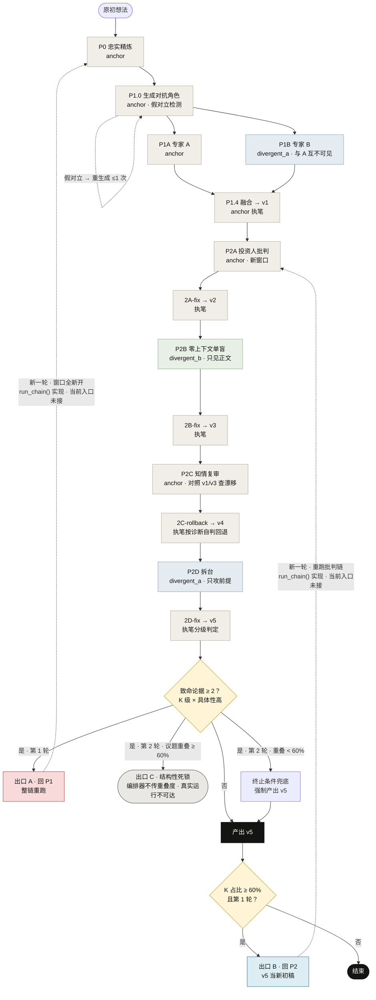
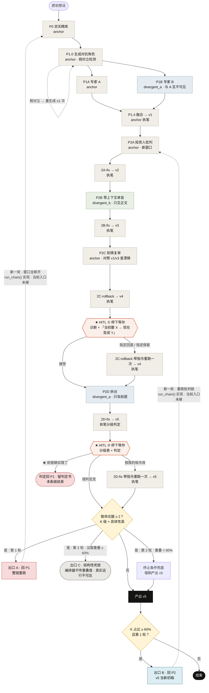

<p align="center">
  
</p>

<p align="center">
  <a href="https://liangyi-five.vercel.app"><strong>在线体验</strong></a> &middot;
  <a href="#快速上手"><strong>快速上手</strong></a> &middot;
  <a href="#架构"><strong>架构</strong></a> &middot;
  <a href="#评测"><strong>评测</strong></a> &middot;
  <a href="README.en.md"><strong>English</strong></a>
</p>

<p align="center">
  <a href="https://liangyi-five.vercel.app"></a>
  
  <a href="engine/test_guarantees.py"></a>
  
  <a href="LICENSE"></a>
</p>

<p align="center">
  
  <br><sub>线上实跑录屏（hitl 档，时间压缩）：选一个示例想法 → 13 步逐步完成 → 两个停点各做一次决定 → 出结果</sub>
</p>

# 两仪 Liangyi · 跨厂商多 Agent 产品想法优化工作流

一个产品想法进去，一份经过四轮独立批判的方案出来。7 个上下文互相隔离的角色 Agent 分属三家厂商、按底模坐标分工：想法先被忠实重述，两位对立专家互不可见地各出方案并融合，再依次经过投资人批判 → 零上下文单盲复审 → 方向漂移诊断 → 前提拆台，最后由执笔者按固定规则给拆台论据分级，判定交付 v5 还是推翻方向。

**为什么要这样做：单个模型自己写、自己审，审不出自己的盲区。**

|        | 阶段 | 做什么 |
| ------ | --- | --- |
| **01** | 精炼与对抗生成 | P0 忠实重述想法；P1.0 生成两个对立角色并做假对立检测；两位专家互不可见各出方案，执笔者融合成 v1 |
| **02** | 四轮独立批判 | 投资人批判 → 单盲复审 → 漂移诊断 → 前提拆台。每轮批判新开窗口，每轮修改都由同一个执笔窗口完成 |
| **03** | 分级判定与回退 | 拆台论据按「打不打前提 × 具体性高不高」分级。路由规则定义三个出口：回 P1 整链重跑 / 回 P2 重跑批判 / 结束交付，两轮封顶；命令行与网页入口目前只跑一轮，第二轮的装置只离线驱动过 |

<sub>一念生两仪，两仪成决策。</sub>

## 目录

- [在线体验](#在线体验)
- [快速上手](#快速上手)
- [它解决什么](#它解决什么)
- [架构](#架构)：[形态定位](#形态定位) · [多 Agent 系统设计](#多-agent-系统设计) · [7 个角色与模型](#7-个角色与模型) · [三个出口](#三个出口) · [完整状态机](#完整状态机)
- [评测](#评测)：[回溯对照](#回溯对照) · [工程侧验证](#工程侧验证) · [验到了什么、没验到什么](#验到了什么没验到什么)
- [项目结构](#项目结构) · [深一层的材料](#深一层的材料) · [同作者的其他项目](#同作者的其他项目)

## 在线体验

**https://liangyi-five.vercel.app** —— 把想法输进去，看它走完全部 13 步。页面带三个示例：订阅管理助手、线上报错诊断助手、VoyageGuard 出行气象决策 Agent（作者自己的项目）。

演示档用三个坐标各不相同的便宜模型（gpt-5.6-luna · deepseek-v4-flash · glm-4-flash），一条链约 6–10 分钟、按 trace 记账约 $0.07–0.09（上方录屏那次 7 分 32 秒、$0.083；trace 只记 13 步本身，影子检测等辅助调用未入账）。每个 IP 每天可新开 3 条链。

- **两档可切**：「自动」一口气跑完；「人工判断」在方向漂移回退（2C）和拆台判定（2D）两处停下，出一张决定卡。
- **决定卡**：2C 的卡先给一句「你当初要的 → 现在变成的」摘要（网页版由 gpt-5.6-luna 对比融合稿 v1 与 v3 生成；命令行版拿原始想法对照漂移诊断），再附漂移诊断原文；2D 的卡附执笔者给每条拆台论据的分级表和判定。三个选项与命令行一致，可附一段指令。选「接受」直接沿用已跑出的产出，不多花一次模型调用；选 2C 的「指定回退 / 指定保留」或 2D 的「按我的指令改」，那一步带着指令重跑一次；2D 选「前提确实错了，回 P1」，本条链到此结束，留一份判定书。顾问材料包可下载，自己拿去问别的模型。
- **运行控制**：停止、继续、失败时只重试那一步、下载整份运行记录。服务端无状态，运行目录在请求体里来回传。

<p align="center">
  
</p>

## 快速上手

```bash
pip install -r requirements.txt
cp .env.example .env                                         # 填 key，各家承担哪些窗口见文件内注释
python3 -m engine.run --check                                # 预检：3 条硬规则 + 各家 key 是否已配置（只查环境变量，不发请求）
python3 -m engine.run -s scenarios/what-to-wear.yaml         # 正式档、auto 档跑一遍（该场景预写了角色，P1.0 跳过，实跑 12 步）
python3 -m engine.run -s scenarios/what-to-wear.yaml -p demo --mode hitl   # 便宜的演示档 + 两个必停点
python3 -m engine.run --resume runs/<运行目录>                # 断点续跑
```

跑完看结果：

```bash
python3 -m engine.inspect runs/<运行目录>                          # 每步谁在跑、花了多少
python3 -m engine.inspect runs/<运行目录> --step P2D               # 某一步的输入、输出
python3 -m engine.inspect runs/<运行目录> --reasoning              # 所有步骤的推理过程
python3 -m engine.inspect runs/<运行目录> --diff idea-v1.md idea-v5.md
```

在线入口本地起：`python3 web/server.py`，然后打开 `http://127.0.0.1:8765`。部署说明见 [`web/DEPLOY.md`](web/DEPLOY.md)。

## 它解决什么

拿着一个想法去问 AI，AI 会顺着你说；再问一次，还是顺着说。三轮之后方案很漂亮，但里面没有一处被认真反对过——**方案的边界是被 AI 的顺从画出来的，不是被人的判断画出来的。**

| 直接问一个模型 | 两仪 |
| --- | --- |
| 同一个模型既写方案又评价方案 | 写与审分开开窗口；专家 B、单盲复审、前提拆台来自与执笔者不同的厂商、不同对齐路线 |
| 意见一次性全给，要同时权衡好几个框架 | 四轮批判线性推进，一次只处理一轮，执笔者逐条决定采纳与否；全部修改由同一个执笔窗口完成，方案不会变成多个 AI 的拼贴 |
| 越改越偏，没人发现方向漂了 | P2C 拿 v1 和 v3 对照专查漂移，2C-rollback 回退 |
| 前提错了也会被打磨得很漂亮 | P2D 的提示词要求只攻方向前提（执笔者仍会把其中一部分判为框架内问题）；执笔者给每条论据分级，2 条以上致命论据就判「回 P1」，停在判定书，不产出 v5 |
| 看不见它为什么这么改 | 每一步读了哪些文件、写出哪份产物、token、成本进 trace，模型返回推理过程时一并记下；逐条修改理由进 decision-log |

## 架构

### 形态定位

按 Anthropic [《Building effective agents》](https://www.anthropic.com/engineering/building-effective-agents) 的分类，两仪是**工作流**而不是自主 agent：13 步由代码确定性编排；出口规则由人在系统外定死，既写进 2D-fix 的提示词，也写成代码 `route()`。当前入口只跑一轮：执笔者按规则分级并写下【判定】，代码读这个标记决定交付还是停下；`route()` 只在多轮驱动里按分级表重算出口。整体是一个**评估者-优化者（evaluator-optimizer）循环**：执笔者产出，四轮批判评估，执笔者据此修订，拆台结果决定交付还是推翻重来。7 个上下文独立、跨厂商的角色 Agent 互相批判，属于多智能体辩论式设计，所以叫多 Agent 工作流。

<p align="center">
  
</p>

### 多 Agent 系统设计

| 维度 | 怎么做 | 代码 |
| --- | --- | --- |
| **Loop** | 确定性编排 13 步；2D-fix 之后按分级表路由三个出口（回 P1 整链重跑 / 回 P2 重跑批判 / 结束），两轮封顶。多轮驱动 `run_chain()`（开第 2 轮前累计花费 ≥ $3 则停）已写好，但没有被任何入口或测试调用；测试用真实判定书逐个驱动了它的零件（出口判定、开第二轮、回 P2 带入上一轮产物）。命令行和网页入口目前只跑一轮，见[三个出口](#三个出口) | [`orchestrator.py`](engine/orchestrator.py) `route()` `run_chain()` |
| **多 Agent 编排** | 7 个角色 Agent 按职责固定分属三个模型槽位，各槽位按「冲突偏向 × 语料文化」两维坐标跨厂商选模型；开跑前校验 3 条硬规则，违反即拒跑 | [`config.py`](engine/config.py) `check_hard_rules()` |
| **上下文隔离** | 每个角色一个独立 messages 数组；单盲窗口每次调用都从空列表开始、不写回历史，续跑补历史时跳过它，显式注入历史会抛异常 | [`window.py`](engine/window.py) |
| **HITL** | 2 个必停点（2C-rollback、2D-fix）。2C 人判「这还是我想要的吗」，不判方案优劣，决定卡给一句「当初要的 → 现在变成的」（命令行拿原始想法对照漂移诊断，网页用 v1→v3 的一句话变化代替）；2D 人判拆台打中的是前提，还是框架内能消化 | [`gate.py`](engine/gate.py) `PRESETS` [`interact.py`](engine/interact.py) [`digest.py`](engine/digest.py) |
| **状态管理** | 断点续跑：跳过已有产物的步骤，并把它们的对话补回执笔窗口，保证修订始终出自同一个执笔者 | [`orchestrator.py`](engine/orchestrator.py) `restore()` · [`run.py`](engine/run.py) `--resume` |
| **Trace** | 每步一行：窗口、模型、输入文件、产物、token、成本、耗时，模型返回推理过程时一并记下；逐条采纳/不采纳/回退的理由进 decision-log | [`trace.py`](engine/trace.py) |

另有不占角色槽位的辅助调用，两档都固定用 gpt-5.6-luna：P0 忠实性与 2A/2B-fix 范围扩大化的影子检测器（各 3 票，所有档位后台运行，只记录不打断）、P1.0 的假对立检测、hitl 档决定卡的摘要。

### 7 个角色与模型

底模坐标两个维度。**维度 A · 冲突偏向**：A1 规范优先（有一份独立于任务的成文规范压过任务——Claude、Gemini）/ A2 权限优先（规范是「谁说了算」的权限链——GPT）/ A3 任务优先（公开材料里找不到独立于任务的规范层，奖励设计围绕任务完成度——DeepSeek、Kimi、GLM）。**维度 B · 语料文化**：B1 英文母语 / B2 中文母语 / B3 跨文化双核。

| 角色 Agent | 槽位 | 正式档模型 | 坐标 | 承担 |
| --- | --- | --- | --- | --- |
| 专家 A | anchor | claude-sonnet-5 | A1·B1 | P0 精炼、P1.0 生成角色、P1 出方案 |
| 专家 B | divergent_a | deepseek-v4-pro | A3·B3 | 独立出方案，看不到 A |
| 执笔 | anchor | claude-sonnet-5 | A1·B1 | 融合出 v1，并执行全部修改 |
| 投资人批判 | anchor | claude-sonnet-5 | A1·B1 | 新开窗口，没有作者包袱 |
| 单盲复审 | divergent_b | glm-5.3 | A3·B2 | 零上下文，只收方案正文 |
| 知情复审 | anchor | claude-sonnet-5 | A1·B1 | 对照 v1 与 v3 查方向漂移 |
| 前提拆台 | divergent_a | deepseek-v4-pro | A3·B3 | **必须由任务优先坐标承担**（开跑前强制）。依据是方法论推断：有规范层的底模会在最关键那一刀上把攻击软化掉；没做过 A1 / A3 拆台对照 |

| 槽位 | 正式档（命令行默认） | 演示档（网页） |
| --- | --- | --- |
| anchor | claude-sonnet-5 · A1·B1 | gpt-5.6-luna · A2·B1 |
| divergent_a | deepseek-v4-pro · A3·B3 | deepseek-v4-flash · A3·B3 |
| divergent_b | glm-5.3 · A3·B2 | glm-4-flash · A3·B2 |

**3 条硬规则**，开跑前校验，违反即拒跑：

1. 只用维度 A 可判定的模型。后训练目标未公开的厂商不进入任何窗口（Qwen、豆包、MiniMax）——项目手上就有可用的千问 key，也照样不用，规则要能约束自己才算数
2. P2 四个批判窗口不能全落在同一坐标，至少要有两个不同坐标。同坐标等于假覆盖
3. 前提拆台必须由 A3 任务优先坐标承担

「单盲必须零上下文」不在开跑前的预检里，由 `window.py` 在运行时保证：单盲窗口每次调用都从空消息列表开始；续跑补历史时跳过它；显式调用 `inject_history()` 会抛 `ZeroContextViolation`，有测试锁定。

<details>
<summary><b>六条设计原则</b></summary>

1. **四轴 divergence** —— AI 身份、角色、上下文、范围是四根独立的轴，各在一步被主要激活：P1 两位专家分属不同底模（AI 身份）、P2A 同一底模换成投资人视角（角色）、P2B 零上下文（上下文）、P2C 对照 v1 与 v3 看整体（范围）
2. **P2 链跨底模坐标** —— 四个批判窗口至少两个不同坐标，同坐标 = 假覆盖。代码在开跑前检查，不过不开跑
3. **单盲 = 零上下文** —— 给了背景它就开始猜意图。单盲窗口每次调用都从空开始，只收方案正文
4. **作者 ≠ 批判者** —— 执笔窗口负责所有修改，批判和复审各自新开
5. **线性链路** —— 四轮批判串行，执笔者每轮只针对一份批判修改。设计源自人工跑方法论时防认知过载：四份批判同时摊开，人要同时持有四个框架
6. **知情复审查的是漂移，不是错漏** —— 细节错漏属于 2A；它问的是响应完前两轮后有没有从最初定位偏移

</details>

### 三个出口

最后一步给每条拆台论据分级：打中前提的记 K 级，具体性高的记 H 级，两者兼有的是**致命论据**。出口规则由人在系统外定死，写进 2D-fix 提示词，也写成代码 `route()`。当前入口里分级和【判定】都由执笔者完成；`route()` 只在多轮驱动里按分级表重算出口：

| 出口 | 条件 | 之后 |
| --- | --- | --- |
| 回 P1 · 整链重跑 | 第 1 轮致命论据 ≥ 2，方向被推翻 | 开第二轮：全部窗口新开，用原始想法从 P0 重跑；P1.0 沿用第一轮生成的对抗角色 |
| 回 P2 · 重跑批判 | 第 1 轮打前提的论据占比 ≥ 60%，但致命论据不到 2 条 | 上一轮 v5 当新一轮 v1，P0/P1 产物沿用，四轮批判及其修订整段重跑 |
| 结束 · 交付 v5 | 其余情况；第 2 轮仍有致命论据时由终止条件兜底强制交付 | 输出 v5 |

最多两轮；开第 2 轮前累计花费已 ≥ $3 则不开。

**实话**：多轮驱动写在 `Orchestrator.run_chain()`，但命令行和网页入口都不调用它，测试也没有直接跑过它（`$3` 预算闸同样没测过）；离线测试只用真实判定书驱动它的零件，验到第二轮能开出来、待跑步骤从 P0 或 P2A 开始为止。真实运行里，2D-fix 的执笔者按同一套分级规则写下【判定】：判回 P1 就停在判定书（`P2D-fix-judgment.md`），这条链到此结束，任何入口都不会开第二轮，人只能重新开一条新链；判产出 v5 就交付。「回 P2」这个出口在真实运行里没有生效过。hitl 档在 2D 停点多一个选项「前提确实错了，回 P1」，选了本条链同样以回 P1 判定收场。

### 完整状态机

<!-- flow:start -->
<details>
<summary><b>auto 档完整状态机</b>（全自动一次不停）</summary>



</details>

<details>
<summary><b>hitl 档完整状态机</b>（只有 ★ 处不同：两个停点各有三个选项；选第 2 / 3 项那一步带指令重跑一次，2D 选「前提确实错了」本条链以回 P1 判定结束）</summary>



</details>
<!-- flow:end -->

图源：[`docs/visualizations/build_flow_mmd.py`](docs/visualizations/build_flow_mmd.py)（两图共用主体，改一处两边同步）。图例：灰 = anchor · 蓝 = divergent_a · 绿 = divergent_b · 橙边 = HITL 停点（auto 档自动通过，hitl 档停下等你）· 虚线 = 回边。图里两条第二轮回边（出口 A → P0、出口 B → P2A）是 `run_chain()` 里的多轮设计，当前入口未接（P1.0 的假对立重生成自环是真实生效的）；「出口 C · 结构性死锁」在代码里有定义，但真实运行不可达。见[没验到什么](#验到了什么没验到什么)。

## 评测

### 回溯对照

拿作者自己做完的项目 [VoyageGuard 出行气象决策 Agent](https://github.com/wenboxia/VoyageGuard)，把它写 PRD 之前的原始想法还原出来（作者口述加最早记录摘取、本人确认，刻意不含写 PRD 时才定下的内容，见 [`seed.md`](retrospective/voyageguard/seed.md)），全自动跑一遍 13 步，再和真实开发史里的返工清单对照。原子点判据和返工清单都在跑之前封存；链条只拿到原始想法，拆解、审计原子点的 agent 没见过清单；初判与独立复判互相看不到对方的结论。

<p align="center">
  
</p>

**VoyageGuard 的返工清单共 21 条，其中 7 条源自原始 PRD 的产品误判，是这条链看得到的范围。这 7 个坑项目初期全踩了；两仪全自动 13 步提前避开 4 个，同一段想法只调用一次模型避开 1 个。** 一个项目、一次运行；两仪一列经初判与独立复判（都是 Claude，复判把 5/7 改成 4/7），单模型一列只判一次，没做跨厂商复核，4/7 不能外推成命中率。完整过程见 [`docs/case-voyageguard.md`](docs/case-voyageguard.md)，凭什么信这些数字见 [`docs/evaluation.md`](docs/evaluation.md)。

<details>
<summary><b>原子点：流程会改动作者原话</b></summary>

<br>

<p align="center">
  
</p>

原始想法先被拆成 14 条原子点，每条按四态判定（守住 / 收窄或变形 / 未守住 / 判不动），判定必须附方案原句。走完拆台后 8 条守住、4 条收窄或变形、2 条未守住（封存初判为 7 / 5 / 2，两者只差 P12 一条边界项）；只调用一次模型的基线守住 12 条。未守住的两条是原话里的「内部用手写 Agent 循环」和「红线规则直接写进提示词」，v5 分别改成了确定性规则引擎判定、带出处的三层阈值。流程守住的少，是因为它会反驳作者，这一点照实列出。

</details>

### 工程侧验证

| 项 | 结果 | 看哪里 |
| --- | --- | --- |
| 真实运行 | 13 次命令行运行：正式档 10 条（9 条跑完、1 条中断），另有早期调试链 1 条（12 步跑完）、演示档测速 1 条、单模型基线 1 条；另有线上演示链 | [`docs/evaluation.md`](docs/evaluation.md) |
| 结构保证测试 | 83 条，锁机制不锁措辞：单盲拒绝注入、同坐标拒跑、路由、续跑、网页 HITL 钩子等。有一部分检查读作者本地的运行记录，而 `runs/` 没有入库：新克隆的仓库只跑到 58 条（57 过 1 挂），真实判定书那组检查会跳过 | [`engine/test_guarantees.py`](engine/test_guarantees.py) |
| 方法论合规检验 | 20 条：7 条通过、8 条不通过（4 条已修、4 条只记录）、5 条只作对照记录不下判；不通过的原样保留 | [`engine/VALIDATION.md`](engine/VALIDATION.md) |

### 验到了什么、没验到什么

| 验到了 | 没验到 |
| --- | --- |
| auto 档单轮端到端跑通，含一次完整回溯对照 | 回 P1、回 P2 的第二轮只在 `run_chain()` 里实现，命令行和网页入口都不调用它；离线只驱动到开出第二轮为止，第二轮的步骤没跑过 |
| 回 P1、回 P2 两个出口判定用真实判定书离线驱动过（判定书在未入库的 `runs/` 里） | 结构性死锁出口需要议题重叠度参数，当前编排器不传，真实运行不可达，也没有测试用例 |
| 83 条结构保证测试在作者本地全过；20 条合规检验 7 过、8 不过（4 条已修） | 判定与复判同属一家模型，跨厂商复核没做；合规检验里 4 条不通过项未修 |
| 网页 hitl 档：停点停得下、决定传得回、记录下得了 | **HITL 档只验了功能，人在这两处介入对方案质量的影响未验证** |
| 回溯对照：两仪 4/7，单模型基线 1/7 | 回溯案例只有一个项目、跑一次 |
| 每步花费按 trace 记账 | 影子检测等辅助调用不入账：每条链另有约 9 次 gpt-5.6-luna 调用，每次读入整份方案；按输入长度估算，演示档约比记账数多两成，正式档占比很小，没有实测 |

还有一条要写在明处：**拆台之后的分级判定不稳定**。同一个场景（subscription-manager）判过四次：09-02 那条链「打中前提 5 条 / 致命 0」，09-06 的 hitl 链「3 / 0」，09-10 那条链对同一份 v4、同一份拆台意见判了两次（第二次是续跑时只重跑这一步），分别是「5 / 2」和「0 / 0」，后两次输入完全相同。整条链上唯一能推翻方向的判断点，自己就在骰子上。细节见 [`docs/evaluation.md`](docs/evaluation.md)。

## 项目结构

```
engine/          多 Agent 工作流的可运行实现：编排、窗口隔离、路由、检测器、trace
  prompts/       每一步的提示词，在线入口共用这同一批文件
  test_guarantees.py   83 条结构保证测试
web/             在线入口：一步一个无状态请求，运行目录整个来回传
api/             Vercel 单入口函数与限次
scenarios/       场景文件（seed + 可选预写角色）
docs/            方法论本体、评测方法、实测案例；images/ 为本页用图，visualizations/ 为生成脚本
retrospective/   VoyageGuard 回溯对照：跑前封存的返工清单与原子点、输入 seed、判定矩阵与结果
experiments/     2026-04 到 05 的六次手工实验档案
```

## 深一层的材料

| 想知道 | 看 |
| --- | --- |
| 方法论本体、判据、红线 | [`docs/liangyi-workflow-refined.md`](docs/liangyi-workflow-refined.md) |
| 拿一个真实项目倒回去重跑的对照 | [`docs/case-voyageguard.md`](docs/case-voyageguard.md) |
| 凭什么信上面那个案例的数字 | [`docs/evaluation.md`](docs/evaluation.md) |
| 多 Agent 工作流每一步谁在跑、两个档位差在哪 | [`engine/PIPELINE.md`](engine/PIPELINE.md) |
| 二十条方法论合规检验，含失败项 | [`engine/VALIDATION.md`](engine/VALIDATION.md) |
| 全自动变种为什么是实验工具不是产品形态 | [`docs/liangyi-auto-variant.md`](docs/liangyi-auto-variant.md) |

## 同作者的其他项目

| 项目 | 是什么 |
| --- | --- |
| [**AIRadar**](https://github.com/wenboxia/airadar) | 每日定时运行的 AI 行业情报工作流 · [在线看](https://wenboxia.github.io/airadar/) |
| [**VoyageGuard**](https://github.com/wenboxia/VoyageGuard) | AI Agent 驱动的出行气象风险决策工具，专注飞机与船只场景，LLM 推理 + 规则引擎安全网双重保障 · [在线用](https://voyageguard-two.vercel.app)。本仓库的回溯对照用的就是它的真实开发史 |

## 作者

夏文博（Wenbo Xia）· AI 产品经理 · 方法论建立于 2026-04-18 一整天的讨论 · [MIT License](LICENSE)
