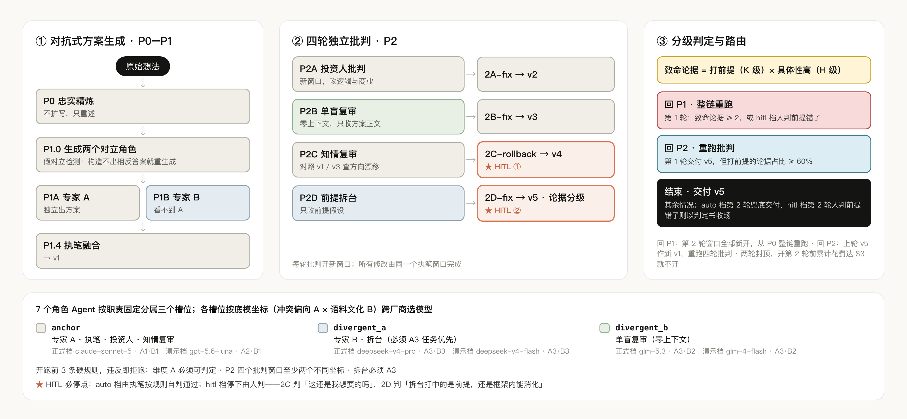
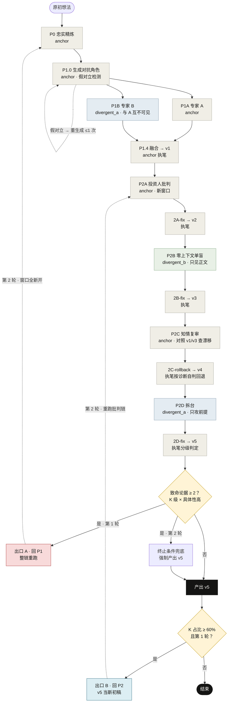
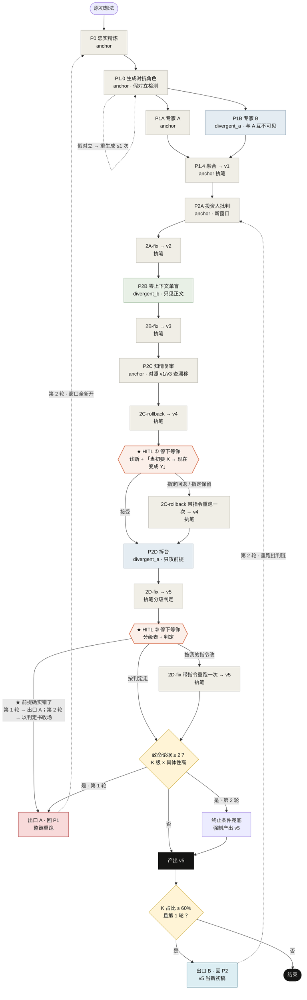
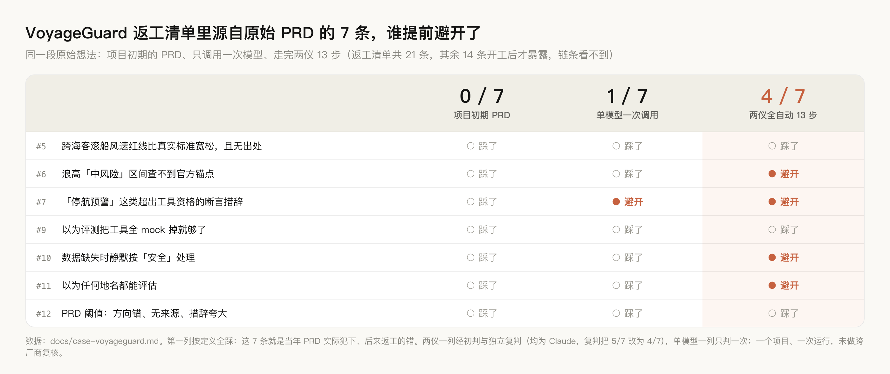
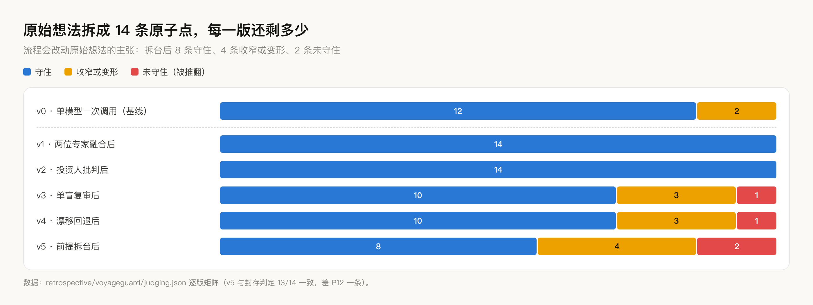

<p align="center">
  
</p>

<p align="center">
  <a href="https://liangyi-five.vercel.app"><strong>在线体验</strong></a> &middot;
  <a href="#快速上手"><strong>快速上手</strong></a> &middot;
  <a href="#架构"><strong>架构</strong></a> &middot;
  <a href="#评测"><strong>评测</strong></a> &middot;
  <a href="README.en.md"><strong>English</strong></a>
</p>

<p align="center">
  <a href="https://liangyi-five.vercel.app"></a>
  
  <a href="engine/test_guarantees.py"></a>
  
  <a href="LICENSE"></a>
</p>

<p align="center">
  
  <br><sub>线上实跑录屏（hitl 档，时间压缩）：选一个示例想法 → 第 1 轮判回 P1 → 第 2 轮整链重跑 → 每轮两个停点各做一次决定 → 交付 v5</sub>
</p>


# 两仪 Liangyi · 跨厂商多 Agent 产品想法优化工作流

一个产品想法进去，一份经过四轮独立批判的方案出来。7 个上下文互相隔离的角色 Agent 分属三家厂商、按底模坐标分工：想法先被忠实重述，两位对立专家互不可见地各出方案并融合，再依次经过投资人批判 → 零上下文单盲复审 → 方向漂移诊断 → 前提拆台，最后按论据严重度决定交付，还是回到起点重跑、只重跑批判。

**为什么要这样做：单个模型自己写、自己审，审不出自己的盲区。**

|        | 阶段 | 做什么 |
| ------ | --- | --- |
| **01** | 精炼与对抗生成 | P0 忠实重述想法；P1.0 生成两个对立角色并做假对立检测；两位专家互不可见各出方案，执笔者融合成 v1 |
| **02** | 四轮独立批判 | 投资人批判 → 单盲复审 → 漂移诊断 → 前提拆台。每轮批判新开窗口，每轮修改都由同一个执笔窗口完成 |
| **03** | 分级判定与回退 | 拆台论据按「打不打前提 × 具体性高不高」分级，按规则走三个出口：回 P1 整链重跑 / 回 P2 重跑批判 / 结束交付。第 2 轮窗口全部新开，两轮封顶 |

<sub>一念生两仪，两仪成决策。</sub>

## 目录

- [在线体验](#在线体验)
- [它解决什么](#它解决什么)
- [架构](#架构)：[流程总览](#流程总览) · [多 Agent 系统设计](#多-agent-系统设计) · [7 个角色与模型](#7-个角色与模型) · [三个出口](#三个出口) · [完整状态机](#完整状态机)
- [评测](#评测)
- [项目结构](#项目结构) · [深一层的材料](#深一层的材料) · [快速上手](#快速上手)

## 在线体验

**https://liangyi-five.vercel.app** —— 把想法输进去，看它走完全部 13 步；第 1 轮判回退时，第 2 轮接着跑。页面带三个示例：订阅管理助手、线上报错诊断助手、VoyageGuard 出行气象决策 Agent（作者自己的项目）。

演示档用三个坐标各不相同的便宜模型（gpt-5.6-luna · deepseek-v4-flash · glm-4-flash），单轮约 6–10 分钟、约 $0.1。每个 IP 每天可新开 3 条链。

- **两档可切**：「自动」一口气跑完；「人工判断」在方向漂移回退（2C）和拆台判定（2D）两处停下，出一张决定卡，每一轮都停。
- **决定卡**：2C 的卡先给一句「你当初要的 → 现在变成的」摘要，再附漂移诊断原文；2D 的卡附执笔者给每条拆台论据的分级表和判定。三个选项与命令行一致，可附一段指令。选「接受」直接沿用已跑出的产出，不多花一次模型调用；选 2C 的「指定回退 / 指定保留」或 2D 的「按我的指令改」，那一步带着指令重跑一次；2D 选「前提确实错了」，走回 P1 出口。
- **运行控制**：停止、继续、失败时只重试那一步、下载整份运行记录（按轮次整理）。服务端无状态，运行目录在请求体里来回传。

<p align="center">
  
</p>

## 它解决什么

拿着一个想法去问 AI，AI 会顺着你说；再问一次，还是顺着说。三轮之后方案很漂亮，但里面没有一处被认真反对过——**方案的边界是被 AI 的顺从画出来的，不是被人的判断画出来的。**

| 直接问一个模型 | 两仪 |
| --- | --- |
| 同一个模型既写方案又评价方案 | 写与审分开开窗口；专家 B、单盲复审、前提拆台来自与执笔者不同的厂商、不同对齐路线 |
| 意见一次性全给，要同时权衡好几个框架 | 四轮批判线性推进，一次只处理一轮，执笔者逐条决定采纳与否；全部修改由同一个执笔窗口完成，方案不会变成多个 AI 的拼贴 |
| 越改越偏，没人发现方向漂了 | P2C 拿 v1 和 v3 对照专查漂移，2C-rollback 回退 |
| 前提错了也会被打磨得很漂亮 | P2D 专攻方向前提；执笔者给每条论据分级，2 条以上致命论据就判回 P1，带着原始想法整链重跑第 2 轮 |
| 看不见它为什么这么改 | 每一步读了哪些文件、写出哪份产物、token、成本进 trace，模型返回推理过程时一并记下；逐条修改理由进 decision-log |

## 架构

### 流程总览

对抗式方案生成 → 四轮独立批判 → 分级判定与路由；7 个角色 Agent 按底模坐标分到三个模型槽位。

<p align="center">
  
</p>

### 多 Agent 系统设计

| 维度 | 怎么做 | 代码 |
| --- | --- | --- |
| **Loop** | 确定性编排 13 步；2D-fix 之后按分级规则走三个出口（回 P1 整链重跑 / 回 P2 重跑批判 / 结束交付）。第 2 轮窗口全部新开，两轮封顶，开第 2 轮前累计花费达 $3 就不开。命令行和网页走同一套路由 | [`orchestrator.py`](engine/orchestrator.py) `route()` `advance()` `run_chain()` |
| **多 Agent 编排** | 7 个角色 Agent 按职责固定分属三个模型槽位，各槽位按「冲突偏向 × 语料文化」两维坐标跨厂商选模型；开跑前校验 3 条硬规则，违反即拒跑 | [`config.py`](engine/config.py) `check_hard_rules()` |
| **上下文隔离** | 每个角色一个独立 messages 数组；单盲窗口每次调用都从空列表开始、不写回历史，续跑补历史时跳过它，显式注入历史会抛异常 | [`window.py`](engine/window.py) |
| **HITL** | 2 个必停点（2C-rollback、2D-fix），每一轮都停。2C 人判「这还是我想要的吗」，不判方案优劣；2D 人判拆台打中的是前提，还是框架内能消化，选「前提确实错了」就走回 P1 出口 | [`gate.py`](engine/gate.py) `PRESETS` [`interact.py`](engine/interact.py) [`digest.py`](engine/digest.py) |
| **状态管理** | 断点续跑：接着最后一轮走，跳过已有产物的步骤，并把它们的对话补回执笔窗口，保证修订始终出自同一个执笔者 | [`orchestrator.py`](engine/orchestrator.py) `restore()` · [`run.py`](engine/run.py) `--resume` |
| **Trace** | 每步一行：轮次、窗口、模型、输入文件、产物、token、成本、耗时，模型返回推理过程时一并记下；逐条采纳/不采纳/回退的理由进 decision-log；每轮判定与收场原因写进 run.json | [`trace.py`](engine/trace.py) |

P0 忠实性与 2A/2B-fix 范围扩大化两个影子检测器在所有档位后台运行（gpt-5.6-luna，各 3 票取多数），只记录不打断。

### 7 个角色与模型

底模坐标两个维度。**维度 A · 冲突偏向**：A1 规范优先（有一份独立于任务的成文规范压过任务——Claude、Gemini）/ A2 权限优先（规范是「谁说了算」的权限链——GPT）/ A3 任务优先（公开材料里找不到独立于任务的规范层，奖励设计围绕任务完成度——DeepSeek、Kimi、GLM）。**维度 B · 语料文化**：B1 英文母语 / B2 中文母语 / B3 跨文化双核。

| 角色 Agent | 槽位 | 正式档模型 | 坐标 | 承担 |
| --- | --- | --- | --- | --- |
| 专家 A | anchor | claude-sonnet-5 | A1·B1 | P0 精炼、P1.0 生成角色、P1 出方案 |
| 专家 B | divergent_a | deepseek-v4-pro | A3·B3 | 独立出方案，看不到 A |
| 执笔 | anchor | claude-sonnet-5 | A1·B1 | 融合出 v1，并执行全部修改 |
| 投资人批判 | anchor | claude-sonnet-5 | A1·B1 | 新开窗口，没有作者包袱 |
| 单盲复审 | divergent_b | glm-5.3 | A3·B2 | 零上下文，只收方案正文 |
| 知情复审 | anchor | claude-sonnet-5 | A1·B1 | 对照 v1 与 v3 查方向漂移 |
| 前提拆台 | divergent_a | deepseek-v4-pro | A3·B3 | **必须由任务优先坐标承担**（开跑前强制）。设计理由：有规范层的底模会在最关键那一刀上把攻击软化掉 |

| 槽位 | 正式档（命令行默认） | 演示档（网页） |
| --- | --- | --- |
| anchor | claude-sonnet-5 · A1·B1 | gpt-5.6-luna · A2·B1 |
| divergent_a | deepseek-v4-pro · A3·B3 | deepseek-v4-flash · A3·B3 |
| divergent_b | glm-5.3 · A3·B2 | glm-4-flash · A3·B2 |

**3 条硬规则**，开跑前校验，违反即拒跑：

1. 只用维度 A 可判定的模型。后训练目标未公开的厂商不进入任何窗口（Qwen、豆包、MiniMax）——项目手上就有可用的千问 key，也照样不用，规则要能约束自己才算数
2. P2 四个批判窗口不能全落在同一坐标，至少要有两个不同坐标。同坐标等于假覆盖
3. 前提拆台必须由 A3 任务优先坐标承担

「单盲必须零上下文」由 `window.py` 在运行时保证：单盲窗口每次调用都从空消息列表开始；续跑补历史时跳过它；显式调用 `inject_history()` 会抛 `ZeroContextViolation`，有测试锁定。

<details>
<summary><b>六条设计原则</b></summary>

1. **四轴 divergence** —— AI 身份、角色、上下文、范围是四根独立的轴，各在一步被主要激活：P1 两位专家分属不同底模（AI 身份）、P2A 同一底模换成投资人视角（角色）、P2B 零上下文（上下文）、P2C 对照 v1 与 v3 看整体（范围）
2. **P2 链跨底模坐标** —— 四个批判窗口至少两个不同坐标，同坐标 = 假覆盖。代码在开跑前检查，不过不开跑
3. **单盲 = 零上下文** —— 给了背景它就开始猜意图。单盲窗口每次调用都从空开始，只收方案正文
4. **作者 ≠ 批判者** —— 执笔窗口负责所有修改，批判和复审各自新开
5. **线性链路** —— 四轮批判串行，执笔者每轮只针对一份批判修改，避免同时持有四个框架
6. **知情复审查的是漂移，不是错漏** —— 细节错漏属于 2A；它问的是响应完前两轮后有没有从最初定位偏移

</details>

### 三个出口

最后一步给每条拆台论据分级：打中前提的记 K 级，具体性高的记 H 级，两者兼有的是**致命论据**。出口规则由人在系统外定死：「致命论据 ≥ 2 回 P1」和第 2 轮兜底写进 2D-fix 的提示词，三个出口的完整规则写成代码 `route()`。执笔者按规则分级并写下【判定】；判回 P1 就开第 2 轮整链重跑；交付了 v5 的，代码再按分级表复核——第 1 轮致命论据 ≥ 2 仍回 P1，打前提的论据占比 ≥ 60% 回 P2 重压。

| 出口 | 条件 | 之后 |
| --- | --- | --- |
| 回 P1 · 整链重跑 | 第 1 轮致命论据 ≥ 2，方向被推翻；或 hitl 档人判前提确实错了 | 第 2 轮：全部窗口新开，用原始想法从 P0 重跑，P1.0 生成的对抗角色沿用 |
| 回 P2 · 重跑批判 | 第 1 轮交付了 v5，但打前提的论据占比 ≥ 60% | 第 2 轮：上一轮 v5 当新一轮 v1，P0/P1 产物沿用，四轮批判及对应修订重跑 |
| 结束 · 交付 v5 | 其余情况；第 2 轮仍判回 P1 时由终止条件兜底改判为交付 | 输出 v5 |

最多两轮；开第 2 轮前累计花费已达 $3 就不再开。hitl 档在 2D 停点多一个选项「前提确实错了」：第 1 轮选它走回 P1 出口，第 2 轮选它这条链以判定书收场。

### 完整状态机

<!-- flow:start -->
<details>
<summary><b>auto 档完整状态机</b>（全自动一次不停）</summary>



</details>

<details>
<summary><b>hitl 档完整状态机</b>（只有 ★ 处不同：两个停点各有三个选项；2C 选第 2 / 3 项、2D 选第 2 项，那一步带指令重跑一次；2D 选「前提确实错了」，第 1 轮走出口 A，第 2 轮以判定书收场）</summary>



</details>
<!-- flow:end -->

图源：[`docs/visualizations/build_flow_mmd.py`](docs/visualizations/build_flow_mmd.py)（两图共用主体，改一处两边同步）。图例：灰 = anchor · 蓝 = divergent_a · 绿 = divergent_b · 橙边 = HITL 停点（auto 档自动通过，hitl 档停下等你）· 虚线 = 第 2 轮回边与 P1.0 的假对立重生成。

## 评测

拿作者自己做完的项目 [VoyageGuard 出行气象决策 Agent](https://github.com/wenboxia/VoyageGuard)，还原出它写 PRD 之前的原始想法（见 [`seed.md`](retrospective/voyageguard/seed.md)），全自动跑一遍，再和它真实开发史里的返工清单对照。原子点判据和返工清单都在跑之前封存，链条只拿到原始想法。

<p align="center">
  
</p>

**VoyageGuard 的返工清单里，有 7 条源自原始 PRD 的产品误判。两仪全自动 13 步提前避开了其中 4 条，同一段想法只调用一次模型避开 1 条。** 完整过程见 [`docs/case-voyageguard.md`](docs/case-voyageguard.md)。

<details>
<summary><b>原子点：流程会反驳作者</b></summary>

<br>

<p align="center">
  
</p>

原始想法先被拆成 14 条原子点，每条按四态判定（守住 / 收窄或变形 / 未守住 / 判不动），判定必须附方案原句。走完拆台后 8 条守住、4 条收窄或变形、2 条未守住；只调用一次模型的基线守住 12 条。未守住的两条是原话里的「内部用手写 Agent 循环」和「红线规则直接写进提示词」，v5 分别改成了确定性规则引擎判定、带出处的三层阈值。

</details>

## 项目结构

```
engine/          多 Agent 工作流的可运行实现：编排、窗口隔离、路由与多轮循环、检测器、trace
  prompts/       每一步的提示词，在线入口共用这同一批文件
  fixtures/      测试用的真实分级表与判定书
  test_guarantees.py   102 条结构保证测试
web/             在线入口：一步一个无状态请求，运行目录整个来回传
api/             Vercel 单入口函数与限次
scenarios/       场景文件（seed + 可选预写角色）
docs/            实测案例、状态机图源、本页用图与生成脚本
retrospective/   VoyageGuard 回溯对照：输入 seed、封存的原子点与返工清单、判定矩阵
```

## 深一层的材料

| 想知道 | 看 |
| --- | --- |
| 多 Agent 工作流每一步谁在跑、两个档位差在哪 | [`engine/PIPELINE.md`](engine/PIPELINE.md) |
| 工程实现：断点续跑、P1.0 角色生成、实测踩过的坑 | [`engine/README.md`](engine/README.md) |
| 拿一个真实项目倒回去重跑的对照 | [`docs/case-voyageguard.md`](docs/case-voyageguard.md) |
| 在线入口的接口与部署 | [`web/DEPLOY.md`](web/DEPLOY.md) |

## 快速上手

```bash
pip install -r requirements.txt
cp .env.example .env                                         # 填 key，各家承担哪些窗口见文件内注释
python3 -m engine.run --check                                # 预检：3 条硬规则 + 各家 key 是否已配置
python3 -m engine.run -s scenarios/voyageguard.yaml          # 正式档、auto 档跑一条完整的链（判回退时自动跑第 2 轮）
python3 -m engine.run -s scenarios/voyageguard.yaml -p demo --mode hitl   # 便宜的演示档 + 两个必停点
python3 -m engine.run --resume runs/<运行目录>                # 断点续跑
python3 -m engine.test_guarantees                            # 结构保证测试，不调模型、不花钱
```

跑完看结果：

```bash
python3 -m engine.inspect runs/<运行目录>                          # 每步谁在跑、花了多少、几轮、判定
python3 -m engine.inspect runs/<运行目录> --step P2D               # 某一步的输入、输出
python3 -m engine.inspect runs/<运行目录> --reasoning              # 所有步骤的推理过程
python3 -m engine.inspect runs/<运行目录> --diff idea-v1.md idea-v5.md
```

在线入口本地起：`python3 web/server.py`，然后打开 `http://127.0.0.1:8765`。
